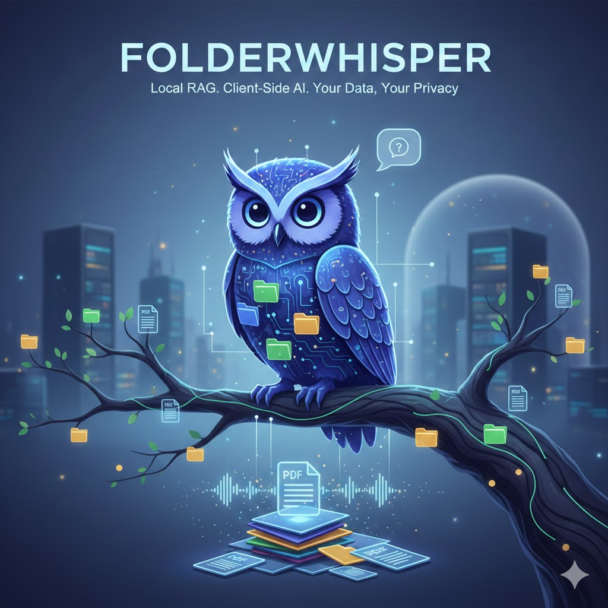

# Folder Whisper

> **Talk to your documents. 100% locally. No APIs. No servers. No leaks.**

FolderWhisper is a **Retrieval-Augmented Generation (RAG) application** that runs entirely inside your browser. You can upload a folder of documents (PDF, TXT, Markdown, DOCX), have them embedded and indexed on-device, and then chat with them using a local Large Language Model — all without a single byte of your data ever leaving your machine.

---

## Key Features

| Feature | Detail |
|---|---|
| 🔒 **Total Privacy** | Documents, embeddings, and LLM inference all stay on your device |
| ⚡ **No API Keys** | Zero dependency on OpenAI, Anthropic, Groq, or any external service |
| 💾 **Persistent Index** | Embeddings are saved to IndexedDB — survives page refresh (F5) |
| 📂 **Folder Upload** | Select an entire folder at once; the app validates and filters files automatically |
| 🧠 **Local LLM** | Runs Phi-3.5, SmolLM2, Llama 3.2 or Gemma on your GPU/CPU via WebLLM |
| 🌐 **Deployable** | Static build deployable on Vercel — the server only serves HTML/JS, does nothing else |
| 📡 **Works Offline** | After the model is downloaded once, you can disconnect Wi-Fi and the app still works |

---

## Architecture

```
┌─────────────────────────────────────────────────────────────┐
│                      USER'S BROWSER                         │
│                                                             │
│  ┌───────────────────┐     ┌────────────────────────────┐   │
│  │    Web Worker     │     │    Main Thread (UI)        │   │
│  │                   │     │                            │   │
│  │  Transformers.js  │     │  ┌──────────────────────┐  │   │
│  │  all-MiniLM-L6-v2 │ --> │  │     IndexedDB        │  │   │
│  │     (~23 MB)      │     │  │  (vectors + chunks)  │  │   │
│  │                   │     │  └──────────┬───────────┘  │   │
│  └───────────────────┘     │             │              │   │
│                            │  ┌──────────▼───────────┐  │   │
│   Runs in background       │  │   Cosine Similarity  │  │   │
│   — UI never freezes       │  │  local vector search │  │   │
│                            │  └──────────┬───────────┘  │   │
│                            │             │              │   │
│                            │  ┌──────────▼───────────┐  │   │
│                            │  │    WebLLM Engine     │  │   │
│                            │  │  (runs on user GPU)  │  │   │
│                            │  │  Phi-3.5 / SmolLM2   │  │   │
│                            │  │  Llama 3.2 / Gemma   │  │   │
│                            │  └──────────────────────┘  │   │
│                            └────────────────────────────┘   │
└─────────────────────────────────────────────────────────────┘
         ↑                               ↑
   Vercel serves                   NOTHING leaves
   static JS/HTML                  the browser 🔒
```

### Data Flow

```
User selects folder
     │
     ▼
File Validator (200 MB limit, .pdf/.txt/.md/.docx only)
     │
     ▼
Web Worker → Text Extraction (PDF.js / mammoth / FileReader)
     │
     ▼
Web Worker → Embedding Generation (all-MiniLM-L6-v2 via Transformers.js)
     │
     ▼
IndexedDB persistence (vectors + raw chunks survive refresh)
     │
User asks a question
     │
     ▼
Query is embedded (same worker, same model)
     │
     ▼
Cosine Similarity Search → Top-5 relevant chunks retrieved
     │
     ▼
RAG Prompt built: [System Prompt + Context Chunks + User Query]
     │
     ▼
WebLLM Engine (local GPU/CPU inference) → Streamed response
     │
     ▼
Chat UI renders answer + source citations (filename + relevance %)
```

---

## 🤖 Available Local LLM Models

All models are downloaded once and cached by the browser. No repeated downloads.

| Model | Size | Requires WebGPU | Best For |
|---|---|---|---|
| 🪶 **SmolLM2 360M** (CPU) | ~200 MB | ❌ Works on CPU | Quick testing, low-end devices |
| 🚀 **SmolLM2 1.7B** | ~1.0 GB | ✅ GPU required | Good balance of speed and quality |
| ⚡ **Phi-3.5 Mini** | ~2.2 GB | ✅ GPU required | Best quality, Microsoft's flagship small model |
| 🦙 **Llama 3.2 1B** | ~800 MB | ✅ GPU required | Meta's efficient instruction-tuned model |
| 💎 **Gemma 2 2B** | ~1.5 GB | ✅ GPU required | Google's model, excellent at text analysis |

> **WebGPU** is supported in Chrome 113+ and Edge 113+. Firefox does not support it yet.  
> If your browser doesn't support WebGPU, use **SmolLM2 360M (CPU)** — it runs entirely on the CPU.

---

## 📚 Library Stack

| Library | Version | Purpose |
|---|---|---|
| **Next.js** | 16 | React framework — App Router, static export, Webpack config |
| **React** | 19 | UI component system |
| **Tailwind CSS** | 4 | Utility CSS (used minimally; mainly custom CSS variables) |
| **`@xenova/transformers`** | 2.x | Runs `all-MiniLM-L6-v2` in-browser via ONNX for embedding generation |
| **`@mlc-ai/web-llm`** | latest | Loads and runs quantized LLMs (Phi-3, Llama, SmolLM2) on WebGPU/CPU |
| **`idb`** | 8 | Promise-based IndexedDB wrapper — persists embedded chunks across sessions |
| **`pdfjs-dist`** | 3 | Extracts text from PDF files client-side, no server needed |
| **`mammoth`** | 1.x | Extracts raw text from `.docx` (Word) files in the browser |
| **`lucide-react`** | latest | Icon set used throughout the UI |

---

## 📂 Supported File Types

| Extension | Parser |
|---|---|
| `.pdf` | PDF.js (full text extraction, multi-page) |
| `.txt` | Native `FileReader` API |
| `.md` | Native `FileReader` API (Markdown treated as plain text) |
| `.docx` | Mammoth.js (Word document text extraction) |

> ⚠️ Maximum total folder size: **200 MB**. Files exceeding the limit are blocked before indexing starts.

---

## 🚀 Getting Started

### Prerequisites

- Node.js 18+
- npm

### Install & Run

```bash
git clone <repo-url>
cd folderwhisper
npm install
npm run dev
```

Open [http://localhost:3000](http://localhost:3000) in **Chrome or Edge** (required for WebGPU models).

### Usage

1. **Add documents** — click `Añadir Carpeta` to select a folder, or the file icon for individual files
2. Wait for **embedding indexing** to finish (first time downloads `all-MiniLM-L6-v2`, ~23 MB)
3. **Select a local LLM model** in the sidebar panel
4. Click **`Cargar [Model Name]`** — the model downloads once and is permanently cached
5. **Ask questions** about your documents — sources and relevance scores are shown with each answer

---

## ☁️ Deploying to Vercel

```bash
npm install -g vercel
vercel --prod
```

The included `vercel.json` sets the required `Cross-Origin-Opener-Policy` and `Cross-Origin-Embedder-Policy` headers that allow `SharedArrayBuffer` (needed for WASM threads in Transformers.js).

---

## 🔐 Privacy Guarantee

- **Your documents never leave your device.** They are read only by the browser's File API.
- **Embeddings are computed locally** inside a Web Worker using a WASM/ONNX model.
- **LLM inference runs on your GPU/CPU.** No token is sent anywhere.
- **Vercel only serves static assets** (HTML, JS, CSS). It receives no document data.
- The only network activity after initial load is the one-time model download from HuggingFace CDN or MLC CDN.

---

## 🗂️ Project Structure

```
src/
├── app/
│   ├── globals.css          # Design system (dark theme, glassmorphism, CSS variables)
│   ├── layout.tsx           # Root layout with SEO metadata
│   └── page.tsx             # Main page — composes all hooks and components
│
├── components/
│   ├── Sidebar.tsx          # Model loader, file upload, storage bar, file list
│   ├── StatusLog.tsx        # Auto-scrolling event log (indexing events)
│   └── ChatPanel.tsx        # Chat UI with markdown rendering and source chips
│
├── hooks/
│   ├── useIndexing.ts       # Web Worker lifecycle, IndexedDB persistence, file validation
│   ├── useLocalLLM.ts       # WebLLM engine (singleton), WebGPU detection, streaming
│   └── useChat.ts           # RAG pipeline: embed query → vector search → LLM → stream
│
├── lib/
│   ├── db.ts                # IndexedDB CRUD (idb) — chunks, embeddings, metadata
│   └── utils.ts             # File validator, text chunker (with overlap), cosine similarity
│
├── types/
│   └── index.ts             # Shared TypeScript types and constants
│
└── workers/
    └── embeddings.worker.ts # Web Worker: text extraction + embedding generation
```

---

## ⚙️ Technical Notes

- **Chunking strategy**: Documents are split by paragraph first, then by sentence, targeting ~500 characters per chunk with 50-character overlap to preserve context across boundaries.
- **Embedding model**: `Xenova/all-MiniLM-L6-v2` produces 384-dimensional vectors. Fast, accurate, and only 23 MB compressed.
- **Vector search**: Pure cosine similarity over all stored chunks — no HNSW index needed at this scale (<100K chunks).
- **Streaming**: WebLLM streams tokens directly into React state for a real-time typing effect.
- **Model singleton**: The WebLLM engine is kept in a module-level variable so it survives React re-renders without reloading the model weights.

---

*Built with ❤️ — 100% client-side, 100% private.*
